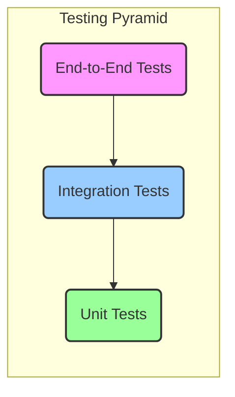

# Testing Strategy

A robust testing strategy is essential for ensuring the application's quality, reliability, and maintainability. We will adopt the "Testing Pyramid" model, which emphasizes a healthy balance of different types of automated tests.



## 1. Unit Tests (Foundation)

*   **Goal**: To test the smallest, most isolated pieces of code (individual functions or simple components) in isolation. They are fast, stable, and cheap to write.
*   **Tools**: [Vitest](https://vitest.dev/) or [Jest](https://jestjs.io/) with [React Testing Library](https://testing-library.com/docs/react-testing-library/intro/).
*   **Coverage Targets**: Utility functions, services, and simple, presentational components.
*   **Examples**:
    *   `services/ruleService.ts`: Test the `applyRulesToEmails` function with various email and rule combinations to ensure it correctly modifies emails.
    *   `utils/parsing.ts` (hypothetical): Test a function that parses sender information from a string like `"John Doe <john@example.com>"`.
    *   `components/AILabelPill.tsx`: Test that the component renders the correct color, icon, and text based on the `label` prop it receives.

## 2. Integration Tests (Middle Layer)

*   **Goal**: To verify that different parts of the application work together as expected. These tests simulate user interactions on a group of components to ensure they are correctly integrated.
*   **Tools**: [React Testing Library](https://testing-library.com/docs/react-testing-library/intro/).
*   **Coverage Targets**: Components that interact with each other, user forms, and simple user flows.
*   **Examples**:
    *   **Email Selection Flow**: Render the `EmailList` and `EmailView` components. Simulate a user clicking an email in the list and assert that the `EmailView` component updates to display the correct content.
    *   **Settings Modal**: Test the `RulesManager`. Simulate a user filling out the form to create a new rule, clicking "Add Rule," and verifying that the new rule appears in the "Existing Rules" list.
    *   **Bulk Actions**: Test that selecting multiple emails in `EmailList` and clicking the bulk "Archive" button correctly calls the `handleArchiveEmails` function with the right email IDs.

## 3. End-to-End (E2E) Tests (Top Layer)

*   **Goal**: To simulate a complete user journey through the application in a real browser environment. These tests provide the highest confidence but are slower and more brittle.
*   **Tools**: [Cypress](https://www.cypress.io/) or [Playwright](https://playwright.dev/).
*   **Coverage Targets**: Critical user paths and core application functionality.
*   **Example Journeys**:
    1.  **Full Junk Mail Flow**:
        *   Load the app.
        *   Click on an email in the inbox.
        *   Click the "Junk" button in the `EmailView`.
        *   Verify the email disappears from the inbox.
        *   Navigate to the "Spam" folder.
        *   Assert that the email is now present in the "Spam" folder.
    2.  **Compose and Send Flow**:
        *   Click the "Compose" button.
        *   Fill in the recipient, subject, and body fields.
        *   Click "Send."
        *   Verify that the compose modal closes and the view switches to the "Sent" folder, showing the newly sent email.

## CI/CD Automation with GitHub Actions

All tests will be automated and run on every push and pull request using GitHub Actions. This ensures that new changes don't break existing functionality.

A sample workflow file (`.github/workflows/ci.yml`):
```yaml
name: CI Pipeline

on:
  push:
    branches: [ main ]
  pull_request:
    branches: [ main ]

jobs:
  test-and-lint:
    runs-on: ubuntu-latest
    steps:
      - name: Checkout repository
        uses: actions/checkout@v4
      - name: Set up Node.js
        uses: actions/setup-node@v4
        with:
          node-version: '20'
          cache: 'npm'
      - name: Install dependencies
        run: npm ci
      - name: Run linter
        run: npm run lint
      - name: Run unit and integration tests
        run: npm test
      - name: Run E2E tests
        run: npm run cypress:run
```
